# 素材尺寸可视化表

参考页面：`https://www.anantaparis.com/looks/heroines-drop/the-rebel`

交付参考环境：`1920 x 1080`

说明：

- “源文件尺寸”是素材本身的尺寸。
- “原站显示尺寸”来自原站 `1920 x 1080` 截图测量或 DOM/CSS 测量。
- 主角和后排人物在原站中绘制在全屏 canvas 内，无法直接从普通 CSS 得到单个人物盒子，所以这里使用截图像素测量。
- 预览图位于 `docs/asset-previews/`。

## 源素材清单

| 名称 | 例图 | 格式 | 源文件尺寸 | 原站 / 模板显示尺寸 | 当前文件 |
| --- | --- | --- | --- | --- | --- |
| 主角主视频 | 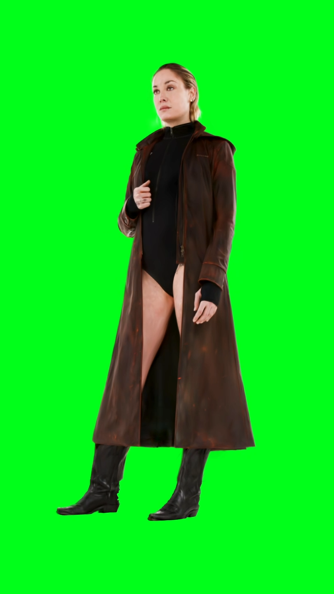 | MP4 | `810 x 1440`, `6s` | 原站 canvas 中主角约 `304 x 845` | `public/images/ananta/rebel-main.mp4` |
| 主角缩略视频 | 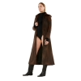 | MP4 | `100 x 100`, `5s` | 原站顶部/横向栏缩略视频 `24 x 24` | `public/images/ananta/rebel-thumb.mp4` |
| 后排视频 Siren | 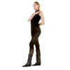 | MP4 | `100 x 100`, `5s` | 当前模板后排视频按原尺寸 `100 x 100` 显示 | `public/images/ananta/ghost-the-siren.mp4` |
| 后排视频 Kiddo | 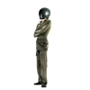 | MP4 | `100 x 100`, `5s` | 当前模板后排视频按原尺寸 `100 x 100` 显示 | `public/images/ananta/ghost-the-kiddo.mp4` |
| 后排视频 Warrior | 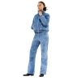 | MP4 | `100 x 100`, `5s` | 当前模板后排视频按原尺寸 `100 x 100` 显示 | `public/images/ananta/ghost-the-warrior.mp4` |
| 后排视频 Domina | 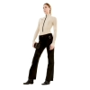 | MP4 | `100 x 100`, `5s` | 当前模板后排视频按原尺寸 `100 x 100` 显示 | `public/images/ananta/ghost-the-domina.mp4` |
| Look 图片原始尺寸 | 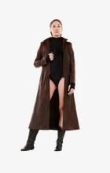 | PNG | `1024 x 1820` | 主角 fallback；右上缩略容器为 `24 x 24` | `public/images/ananta/look-the-rebel.png` |
| Look 图片 Kiddo | 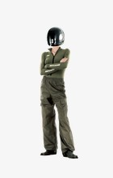 | PNG | `1024 x 1820` | 右上缩略容器 `24 x 24`，顶部裁切 | `public/images/ananta/look-the-kiddo.png` |
| Look 图片 Warrior | 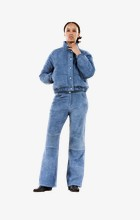 | PNG | `1024 x 1820` | 右上缩略容器 `24 x 24`，顶部裁切 | `public/images/ananta/look-the-warrior.png` |
| Look 图片 Siren | 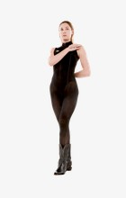 | PNG | `1024 x 1820` | 当前作为隐藏 fallback 使用 | `public/images/ananta/look-the-siren.png` |
| Look 图片 Domina | 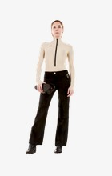 | PNG | `1024 x 1820` | 当前作为隐藏 fallback 使用 | `public/images/ananta/look-the-domina.png` |
| 时间轴桌面图 | 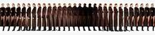 | JPG | `480 x 96` | 原站桌面显示约 `175.4 x 24` | `public/images/ananta/rebel-timeline-desktop.jpg` |
| 时间轴移动图 | 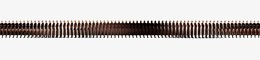 | JPG | `1562 x 116` | 当前组件未单独启用 | `public/images/ananta/rebel-timeline-mobile.jpg` |
| 商品缩略图 Nikita | 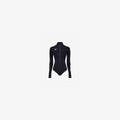 | JPG | `40 x 60` | 原站/模板商品栏显示 `24 x 24` | `public/images/ananta/product-nikita-thumb.jpg` |
| 商品缩略图 Beatrix | 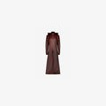 | JPG | `40 x 60` | 原站/模板商品栏显示 `24 x 24` | `public/images/ananta/product-beatrix-thumb.jpg` |
| 商品详情图 Nikita | 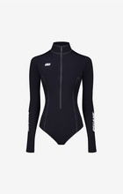 | JPG | `2000 x 3000` | 当前首屏不显示；用于后续商品详情 | `public/images/ananta/product-nikita-body-black.jpg` |
| 商品详情图 Beatrix | 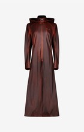 | JPG | `2000 x 3000` | 当前首屏不显示；用于后续商品详情 | `public/images/ananta/product-beatrix-coat.jpg` |

## 原站 1920x1080 画面比例

这些是从原站截图中裁切的画面位置，用于还原最终交付画面里的远近比例。

| 名称 | 原站截图裁切 | 格式 | 原站显示尺寸 | 相对主角高度 | 说明 |
| --- | --- | --- | --- | --- | --- |
| 左侧远景人物 | 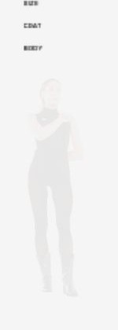 | Canvas 截图裁切 | `78 x 348` | `41%` | 最远、最淡，靠左边缘 |
| 左侧中景人物 | 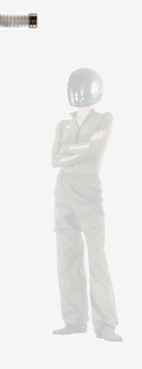 | Canvas 截图裁切 | `181 x 534` | `63%` | 后排中景人物 |
| 主角人物 | 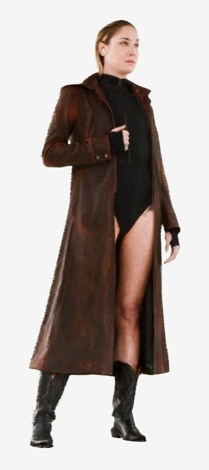 | Canvas 截图裁切 | `304 x 845` | `100%` | 主视觉人物 |
| 右侧中景人物 | 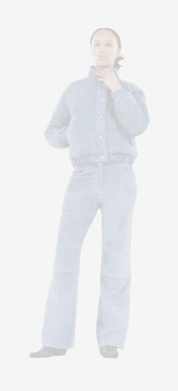 | Canvas 截图裁切 | `177 x 485` | `57%` | 后排中景人物 |
| 右侧远景人物 | 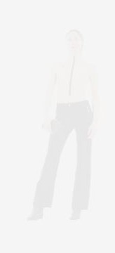 | Canvas 截图裁切 | `99 x 272` | `32%` | 最远、最淡，靠右边缘 |
| 时间轴在原站中的显示 | 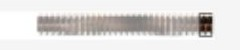 | 截图裁切 | `175.4 x 24` | - | 左侧信息区下方 |
| 商品栏在原站中的显示 | 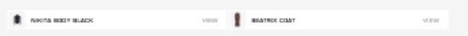 | 截图裁切 | `626.7 x 28` | - | 左下角固定栏 |
| 右上 Look 导航 | 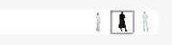 | 截图裁切 | 视频缩略图 `24 x 24` | - | 右上角 look 切换栏 |

## 替换建议

| 素材类型 | 建议新素材规格 |
| --- | --- |
| 主角视频 | 竖版 MP4，`810 x 1440` 或更高，绿幕/纯色背景便于抠像 |
| 后排视频 | 正方形 MP4，至少 `100 x 100`；若希望更清晰，建议 `400 x 400`，但显示时保持原比例 |
| Look 静态图 | PNG，`1024 x 1820`，透明或干净背景 |
| 时间轴图 | 桌面 `480 x 96`，移动端 `1562 x 116` |
| 商品缩略图 | JPG/PNG，至少 `40 x 60`，会放进 `24 x 24` 容器 |
| 商品详情图 | JPG/PNG，`2000 x 3000` |
